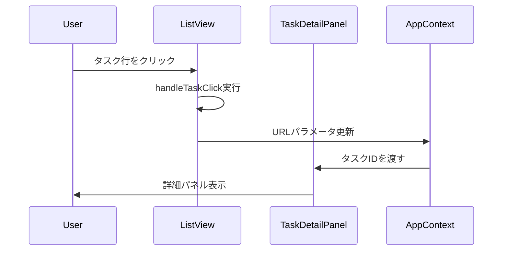

# <FeatureName> 機能仕様書

## 基本情報
- **機能名**: 
- **作成日**: YYYY-MM-DD
- **最終更新日**: YYYY-MM-DD
- **担当者**: 

## 概要

<機能の目的と概要を記述>

## ユーザーストーリー

- **As a** <ユーザー>
- **I want to** <やりたいこと>
- **So that** <目的>

## 動作フロー

### 詳細ステップ

1. ユーザーがタスク行をクリック
2. `handleTaskClick`関数が実行される
3. `setSearchParams({ task: task.id })`でURLパラメータを更新
4. `TaskDetailPanel`がURLパラメータを検知
5. 該当タスクの詳細を表示

## 例外処理

### ケース1: セレクターをクリック
- **動作**: ドロップダウンが開く
- **期待**: 詳細パネルは開かない
- **理由**: `stopPropagation`でイベント伝播を防ぐ

### ケース2: 完了チェックボックスをクリック
- **動作**: 完了/未完了が切り替わる
- **期待**: 詳細パネルは開かない
- **理由**: `CompletionCheckButton`内部で`stopPropagation`

### ケース3: ドラッグ中
- **動作**: タスクの並び替え
- **期待**: 詳細パネルは開かない
- **理由**: ドラッグ中はクリックイベントが発火しない

## 関連コンポーネント

### 主要コンポーネント
- [`ListView.jsx`](file:///Users/fumiyatanaka/Google_Antigravity/INCO/app/src/components/features/list/ListView.jsx)
- [`TaskDetailPanel.jsx`](file:///Users/fumiyatanaka/Google_Antigravity/INCO/app/src/components/features/task/TaskDetailPanel.jsx)

### セレクターコンポーネント
- [`AssigneeSelector`](file:///Users/fumiyatanaka/Google_Antigravity/INCO/app/src/components/features/task/SharedComponents.jsx)
- [`TypeSelector`](file:///Users/fumiyatanaka/Google_Antigravity/INCO/app/src/components/features/task/SharedComponents.jsx)
- [`StatusSelector`](file:///Users/fumiyatanaka/Google_Antigravity/INCO/app/src/components/features/task/SharedComponents.jsx)
- [`PrioritySelector`](file:///Users/fumiyatanaka/Google_Antigravity/INCO/app/src/components/features/task/SharedComponents.jsx)

### その他
- [`CompletionCheckButton`](file:///Users/fumiyatanaka/Google_Antigravity/INCO/app/src/components/features/task/SharedComponents.jsx)

## テストシナリオ

### シナリオ1: 正常系
1. [ ] タスク行をクリックして詳細パネルが開く
2. [ ] 別のタスク行をクリックして詳細が切り替わる
3. [ ] パネル外をクリックして詳細パネルが閉じる

### シナリオ2: セレクター操作
1. [ ] 担当者セレクターをクリックしてドロップダウンが開く
2. [ ] 詳細パネルは開かない
3. [ ] 担当者を選択してドロップダウンが閉じる

### シナリオ3: 完了チェックボックス
1. [ ] 完了チェックボックスをクリック
2. [ ] 完了/未完了が切り替わる
3. [ ] 詳細パネルは開かない

## パフォーマンス要件

- タスク行クリックから詳細パネル表示まで: 100ms以内
- セレクタークリックからドロップダウン表示まで: 50ms以内

## アクセシビリティ

- [ ] キーボードナビゲーション対応
- [ ] スクリーンリーダー対応
- [ ] ARIA属性の適切な使用

## 過去の問題

### 2026-01-30: タスク行クリックで詳細が開かない
- **原因**: stopPropagationの三重使用
- **症状**: クリックイベントが親要素に伝播しない
- **解決**: セレクターにreadOnlyプロップを追加
- **関連ファイル**: ListView.jsx, SharedComponents.jsx
- **影響範囲**: タスク一覧全体

## 参考資料

- [UI_BEHAVIOR.md](file:///Users/fumiyatanaka/Google_Antigravity/INCO/docs/specifications/UI_BEHAVIOR.md)
- [LIST_SPEC.md](file:///Users/fumiyatanaka/Google_Antigravity/INCO/docs/specifications/LIST_SPEC.md)
